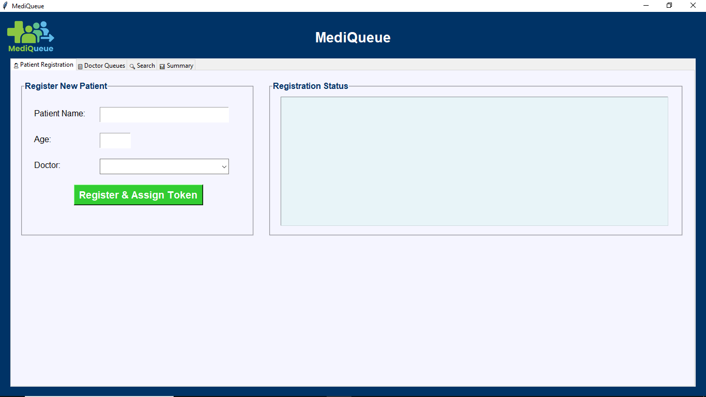
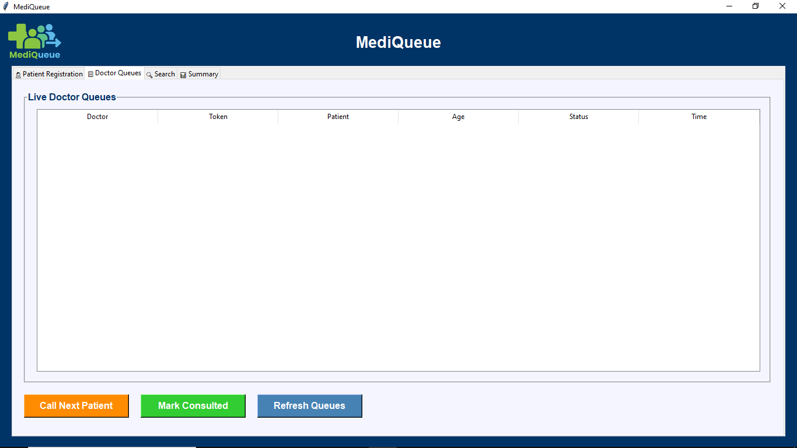
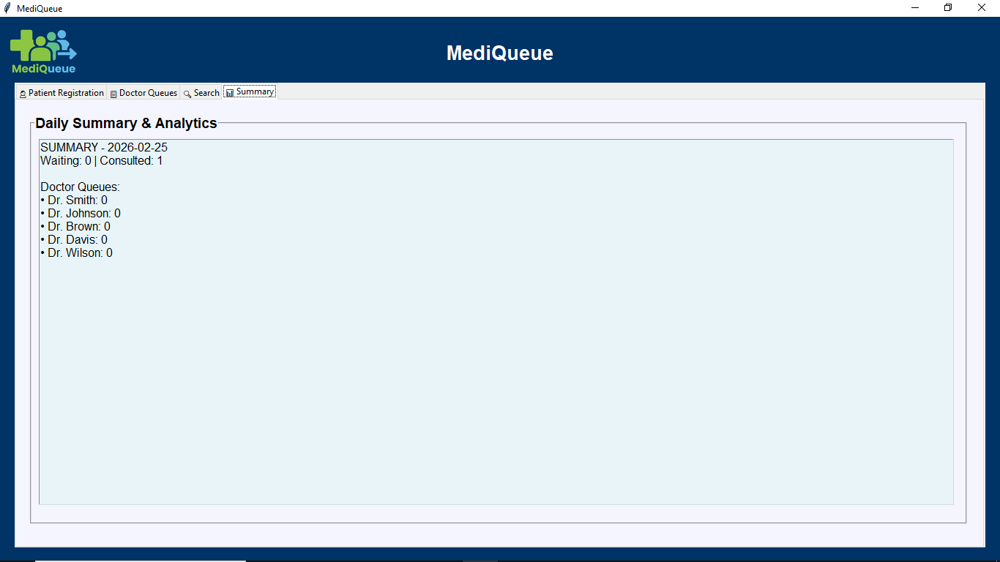

# MediQueue – Hospital OPD Queue Management System

## Introduction

MediQueue is a Python-based Hospital OPD Queue Management System developed using Tkinter and SQLite3.  
It simulates a real-world front-desk reception workflow where patient registration, doctor-wise token generation, live queue handling, consultation tracking, and daily reporting are managed through a single desktop interface.

The system is designed to reflect practical OPD operations with structured queue logic and database-driven record management.

---

## Features

### Reception Module
- Register patients with Name and Age  
- Select doctor from available doctor list  
- Automatic doctor-specific token generation  
- Instant addition to respective doctor queue  
- Real-time queue updates  

### Live Consultation Panel
- Displays current patient for each doctor  
- FIFO (First-In-First-Out) queue logic  
- Single **Consult** button per doctor  
- Automatically loads next patient after consultation  
- Moves completed patients to consulted list  

### Queue Management
- View complete waiting list  
- View consulted patient list  
- Doctor-wise queue tracking  
- Real-time refresh functionality  

### Search System
- Search by patient name  
- Search by token number  
- Displays patient details including doctor and consultation status  

### Reports
- Daily consulted patient report  
- Doctor-wise patient count  
- Total registrations vs consultations  
- Database-driven report generation  

### Doctor Management
- Add new doctors dynamically  
- Automatic queue creation for new doctors  
- Independent token series per doctor  

---

## Tech Stack

- Python 3  
- Tkinter  
- SQLite3  
- Datetime  

---

## Screenshots

### Registration Window

### Queue Window

### Search Window

### Summary Window

## Logo

---

## System Architecture

- Reception Module  
- Doctor-wise Queue Engine  
- Token Generation System  
- Consultation Tracking Module  
- Daily Reporting System  

---

## How to Run

- Clone or download the repository  
- Ensure Python 3 is installed  
- Install required libraries: `pillow`
- Ensure the database file is present in the project folder  
- Run `main.py`  

---

## Notes

- Designed for reception-only usage (no doctor login required)  
- Each doctor maintains an independent FIFO queue  
- Consultation records are stored for daily reporting  
- System is optimized for single-day OPD workflow  

---

## Project Purpose

This project was developed to gain hands-on experience with:

- Desktop GUI development using Tkinter  
- Database-driven system design using SQLite  
- Queue logic implementation (FIFO model)  
- Real-world hospital OPD workflow simulation  
- Structured modular application design  

---

## Author

Adesh Prabhune
